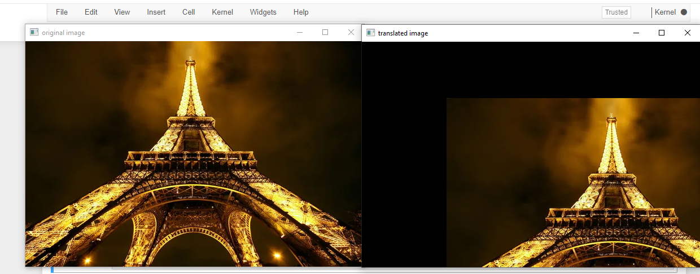
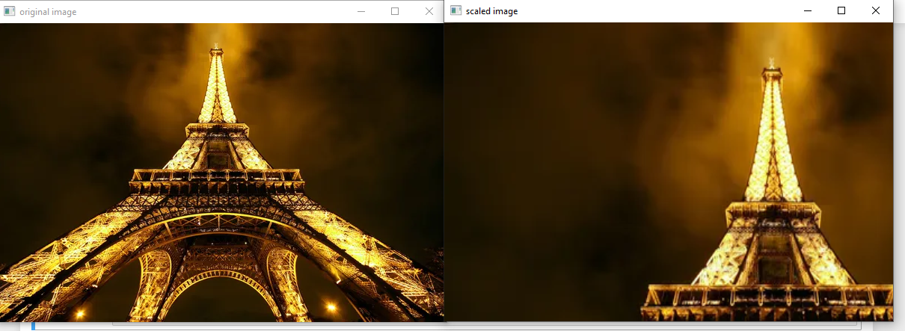
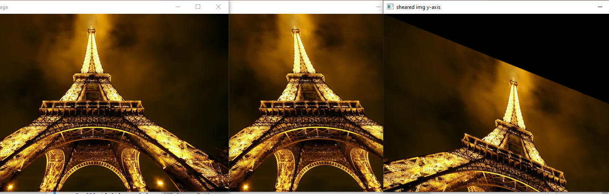
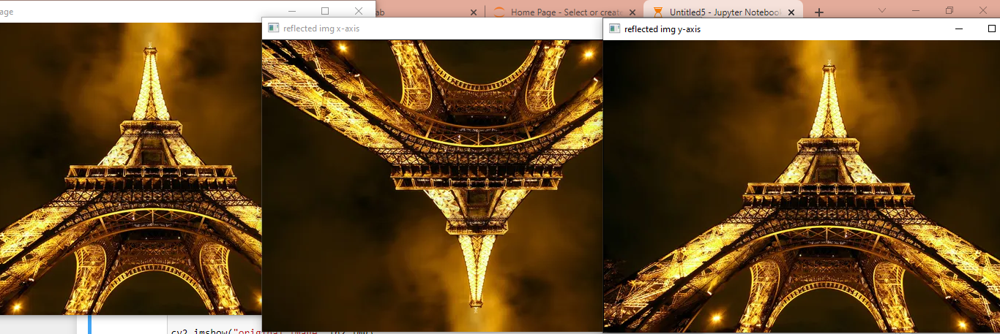
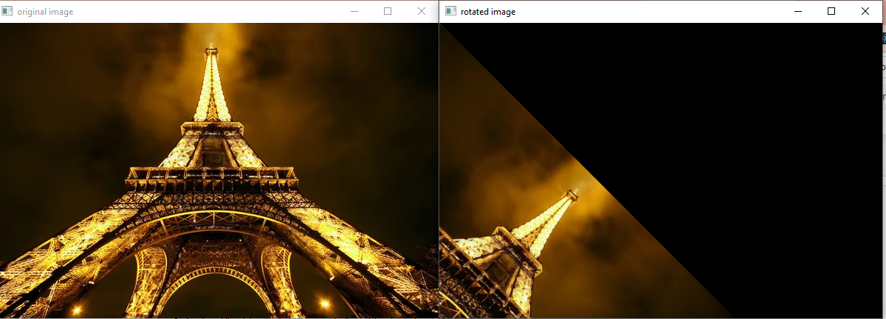
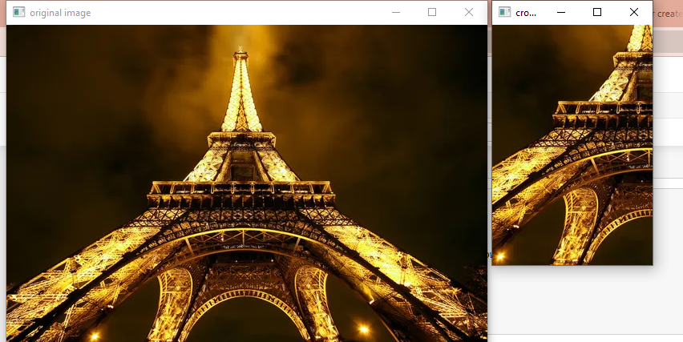

# Image-Transformation
## Aim
To perform image transformation such as Translation, Scaling, Shearing, Reflection, Rotation and Cropping using OpenCV and Python.

## Software Required:
Anaconda - Python 3.7

## Algorithm:
### Step1:

Import the required libraries and read the original image.

### Step2:

Translate the image.
### Step3:

Scale and shear the image

### Step4:

Find the reflected area

### Step5:

Display the output

## Program:
```python
Developed By:V.NAVYA
Register Number:212221230069
i)Image Translation

import numpy as np
import cv2

in_img=cv2.imread("par.jpg",1)

#getting rows,columns,hues(if any)
rows,cols,dim=in_img.shape

#image translation
m=np.float32([[1,0,150],[0,1,100],[0,0,1]])
trans_img=cv2.warpPerspective(in_img,m,(cols,rows))

cv2.imshow("original image",in_img)
cv2.imshow("translated image",trans_img)
cv2.waitKey(0)
cv2.destroyAllWindows()

ii) Image Scaling


m=np.float32([[1.5,0,0],[0,1.8,0],[0,0,1]])
scale_img=cv2.warpPerspective(in_img,m,(cols,rows))

cv2.imshow("original image",in_img)
cv2.imshow("scaled image",scale_img)
cv2.waitKey(0)
cv2.destroyAllWindows()


iii)Image shearing

m_x=np.float32([[1,0.2,0],[0,1,0],[0,0,1]])
m_y=np.float32([[1,0,0],[0.4,1,0],[0,0,1]])

sheared_img_x=cv2.warpPerspective(in_img,m_x,(cols,rows))
sheared_img_y=cv2.warpPerspective(in_img,m_y,(cols,rows))

cv2.imshow("original image",in_img)
cv2.imshow("sheared img x-axis",sheared_img_x)
cv2.imshow("sheared img y-axis",sheared_img_y)
cv2.waitKey(0)
cv2.destroyAllWindows()

iv)Image Reflection

in2_img=cv2.imread("par.jpg",1)
rows2,cols2,dim2=in2_img.shape

m_x=np.float32([[1,0,0],[0,-1,rows2],[0,0,1]])
m_y=np.float32([[-1,0,cols2],[0,1,0],[0,0,1]])
reflected_img_x=cv2.warpPerspective(in2_img,m_x,(cols2,rows2))
reflected_img_y=cv2.warpPerspective(in2_img,m_y,(cols2,rows2))

cv2.imshow("original image",in2_img)
cv2.imshow("reflected img x-axis",reflected_img_x)
cv2.imshow("reflected img y-axis",reflected_img_y)
cv2.waitKey(0)
cv2.destroyAllWindows()


v)Image Rotation

angle=np.radians(45)
m=np.float32([[np.cos(angle),-(np.sin(angle)),0],
              [np.sin(angle),np.cos(angle),0],
              [0,0,1]])
rotated_img=cv2.warpPerspective(in_img,m,(cols,rows))

cv2.imshow("original image",in_img)
cv2.imshow("rotated image",rotated_img)
cv2.waitKey(0)
cv2.destroyAllWindows()


vi)Image Cropping

crop_img=in2_img[100:400,100:300]

cv2.imshow("original image",in_img)
cv2.imshow("cropped image",crop_img)
cv2.waitKey(0)
cv2.destroyAllWindows()


```
## Output:
### i)Image Translation




### ii) Image Scaling




### iii)Image shearing




### iv)Image Reflection




### v)Image Rotation




### vi)Image Cropping





## Result: 

Thus the different image transformations such as Translation, Scaling, Shearing, Reflection, Rotation and Cropping are done using OpenCV and python programming.
